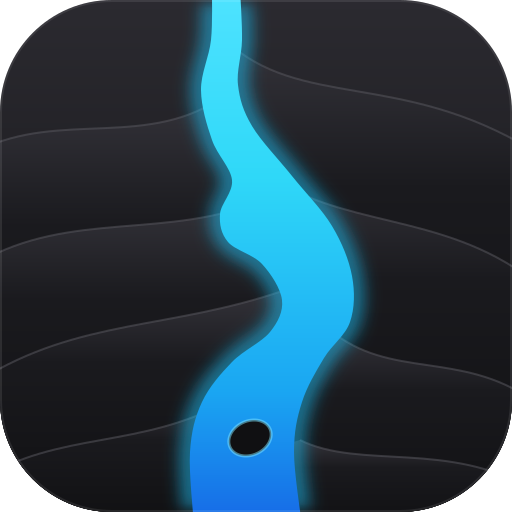

<p align="center">
  
</p>

# Porthmos

A dual-panel file manager: local files in one panel, an SSH/SFTP connection
in the other, with saved connection profiles, bookmarks, search, and background
file transfers between the two. It currently runs in the terminal.

## Features

- Dual-panel file browser — local filesystem on one side, a remote SFTP
  session on the other.
- Saved connection profiles (host, port, username, identity file, remote
  path, optional password), stored alongside connections read from
  `~/.ssh/config`.
- Background file transfers between local and remote, queued and
  cancellable, with progress reporting.
- Recursive filename search on both the local and remote side.
- Bookmarks for quickly jumping back to a local path or a remote path on a
  given host.
- Drop to a full `ssh` terminal session for the active connection and back,
  without losing your place in the file browser.

## Installing

Requires a Rust toolchain supporting the 2024 edition (stable is fine).

```sh
cargo build --release
```

The binary is written to `target/release/porthmos`.

Optional: install [`sshpass`](https://linux.die.net/man/1/sshpass) if you
want the F4 terminal handoff to use a saved profile password automatically,
instead of prompting for it again.

**Platform:** Linux and macOS only — the app relies on Unix file
permissions and process APIs throughout.

## Project layout

The repository is a Cargo workspace:

- `porthmos-vfs` — the virtual filesystem contract every protocol
  implements (`FileSystem`, `Protocol`, `Prompter`) and the shared file types.
- `porthmos-lfs` — the local file system as a `FileSystem`.
- `protocols/` — one crate per remote protocol, each depending only on
  `porthmos-vfs`:
  - `protocols/sftp` (`porthmos-sftp`) — SSH/SFTP: connecting,
    authentication, host keys, `~/.ssh/config` discovery and the `ssh`
    terminal hand-off.
- `porthmos-core` — the UI-free engine: connections, listings, transfers,
  search, profiles, bookmarks and settings. A frontend drives it by sending
  commands and receiving events.
- `porthmos-tui` — the terminal interface, built as the `porthmos`
  binary.

## Keybindings

| Key | Action |
| --- | --- |
| `F1` | Help |
| `F2` | Rename (Edit Connection on the Connections screen) |
| `F4` | Open a terminal session on the active connection |
| `F5` | Copy selected file(s) |
| `F6` | Add Connection (Connections screen) |
| `F7` | Create directory |
| `F8` / `Delete` | Delete (Delete Connection on the Connections screen) |
| `F9` | Open Connections screen |
| `F10` | Quit |
| `Tab` | Switch panel |
| `↑` / `↓` | Move selection |
| `Enter` | Open |
| `Space` | Toggle selection |
| `Esc` | Back / dismiss |
| `Ctrl+R` | Refresh |
| `Ctrl+C` | Cancel active transfer |
| `Ctrl+H` | Toggle hidden files |
| `Ctrl+S` | Cycle sort order |
| `Ctrl+D` | Bookmark current location |
| `Ctrl+B` | Open bookmarks |
| `Ctrl+F` | Search |
| `Ctrl+N` | Cycle remote session |

Press `F1` in the app at any time for the full, live list — it reflects the
actual configured bindings rather than this table.

## Configuration

Settings, saved connections, and bookmarks live under
`$XDG_CONFIG_HOME/porthmos` (or `~/.config/porthmos` if unset):

- `config.toml` — panel, transfer and key-binding settings. See
  [`config/config.example.toml`](config/config.example.toml) for every
  option with its default.
- `connections.toml` — saved connection profiles.
- `bookmarks.toml` — saved bookmarks.

If you used this app under its old name, TermConnect, your old
`termconnect` config folder is moved to the new location on first start,
unless a `porthmos` folder already exists.

Logs go to `$XDG_STATE_HOME/porthmos/porthmos.log` (or
`~/.local/state/porthmos/porthmos.log`); set `RUST_LOG` to control
verbosity.

## Icon and brand colors

The icon, `assets/icon/porthmos.svg`, shows a glowing blue strait flowing
between dark, layered land. *Porthmos* (πορθμός) is Greek for "strait".

Run `scripts/icons/generateIcons.sh` to export it as PNGs (16–1024 px) into
`assets/icon/png/`; the PNGs are not committed. The script needs `rsvg-convert` or `resvg`, because the
glow uses a blur filter.

| Color | Hex |
| --- | --- |
| Land (dark charcoal) | `#101012` → `#2b2a30` |
| Water (cyan to blue) | `#4fe3ff` → `#2fd8f8` → `#1aa6f2` → `#1668e6` |

## License

MIT — see [LICENSE](LICENSE).
